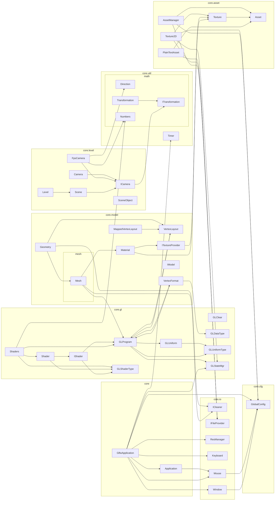

## Project Structure

```mermaid
graph LR
subgraph core.asset
    AssetManager-->Asset
    Texture2D-->Texture-->Asset
    PlainTextAsset-->Asset
end
subgraph core.cfg
    GlobalConfig
end
subgraph core.gl
    GLClear
    GLDataType
    Shaders-->Shader-->IShader-->GLProgram-->GLUniform-->GLUniformType
    Shaders-->GLProgram-->GLUniformType
    Shaders-->GLShaderType
    Shader-->GLShaderType
    IShader-->GLShaderType
    GLProgram-->GLStateMgr
end
subgraph core.io
    ICleaner
    IFileProvider
    ResManager
    Keyboard
    Mouse
    Window
end
subgraph core.level
    Camera-->ICamera
    FpsCamera-->ICamera
    Level-->Scene-->ICamera
    SceneObject
end
subgraph core.model
    Geometry-->VertexLayout
    MappedVertexLayout-->VertexLayout
    Material-->ITextureProvider
    VertexFormat
    IModel
    subgraph mesh
        Mesh
    end
end
subgraph core.util
    Timer
    subgraph math
        Direction
        Transformation-->ITransformation
        Numbers
    end
end
subgraph core
    ga[GlfwApplication]-->Application
end
VertexFormat-->GLProgram-->VertexLayout-->GLProgram
GLProgram-->VertexFormat
PlainTextAsset-->IFileProvider
Texture2D-->GlobalConfig
Texture2D-->GLStateMgr
Texture2D-->IFileProvider
ITextureProvider-->Texture
Material-->Texture
Application-->Mouse
ga-->Mouse
ga-->Timer
ga-->GLStateMgr
ga-->GlobalConfig
ga-->Keyboard
ga-->Window
ga-->ResManager
ICamera-->ITransformation
FpsCamera-->Direction
FpsCamera-->Numbers
AssetManager-->IFileProvider
AssetManager-->GlobalConfig
Mouse-->GlobalConfig
Window-->GlobalConfig
Shaders-->Numbers
Geometry-->ICleaner
Geometry-->Mesh
Mesh-->ICleaner
Mesh-->GLProgram
Mesh-->Material
VertexFormat-->GLDataType
```
