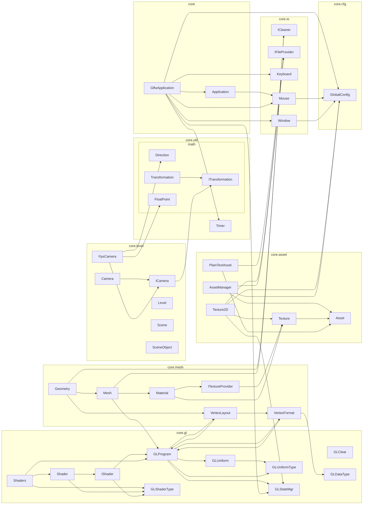

# swgl-core 

[](https://github.com/Over-Run/swgl-core/actions/workflows/gradle.yml)  


  


swgl - A game engine:coffee:.

[If there are any bugs, tell us!](https://github.com/Over-Run/swgl-core/issues/new)

## Project Structure



## Use for depending on

```groovy
dependencies {
    implementation "io.github.over-run:swgl-core:${current_version}"
}
```

## JVM Args

`-Dswgl.coreProfile=false`: Disable OpenGL 3.2 core profile

## Example

```java
public class Example {
//TODO
}
```
